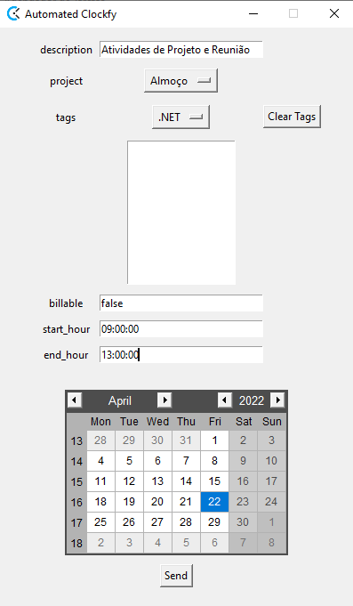

# AutomatedClockFy

As every good programmer knows, the more automated the better. That's why this small private project was started to launch clockfy hours in an "automated" way.

Set your credentials in credentials.json, Edit the fields, click submit, and you're done. Never have problems with unposted hours on clockfy again.

Next Steps features:
- List of available tags (instead of typing)
- Set multiple tags
- List of projects (instead of typing)
- Improvement in "start_hour" and "end_hour" field (maybe)
- Possible Improvements on GUI
- Use instructions on documents
